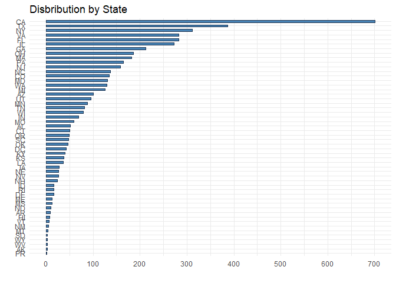
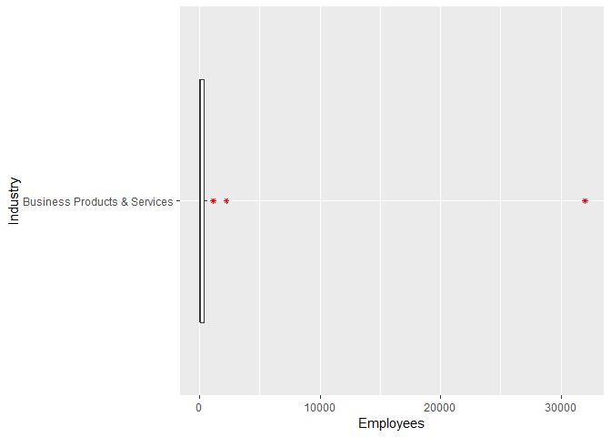
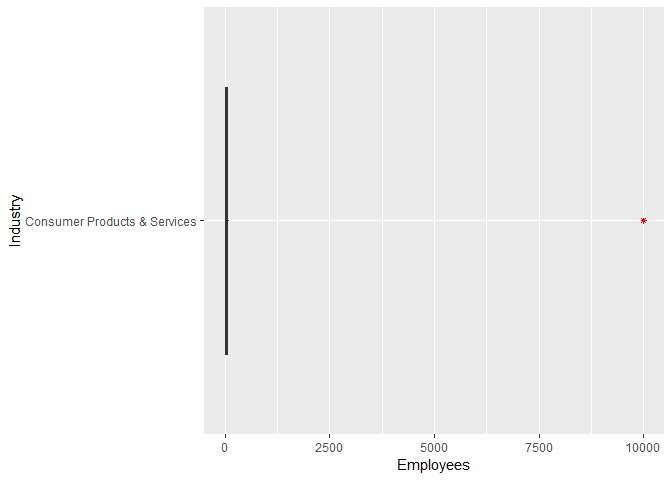
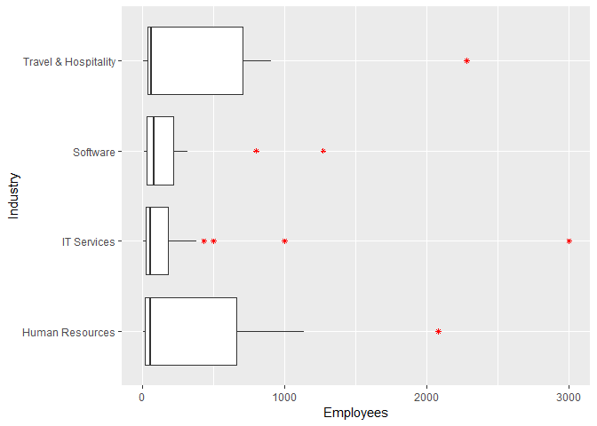
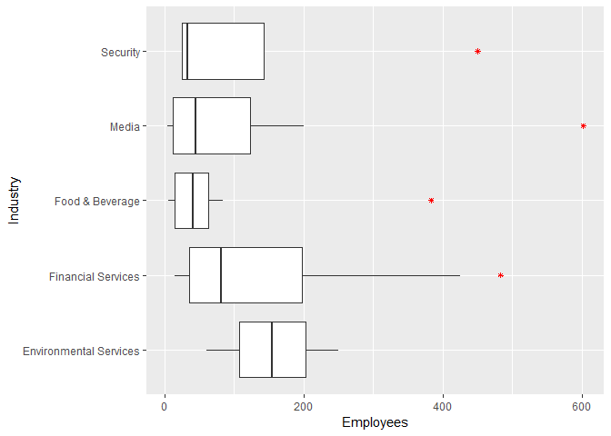
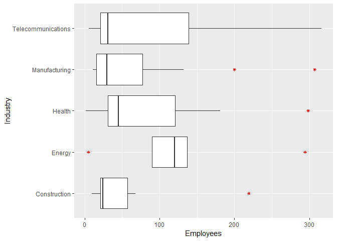
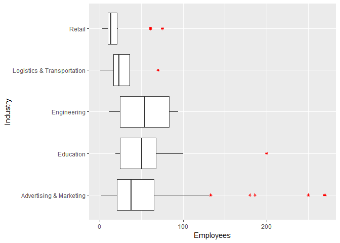
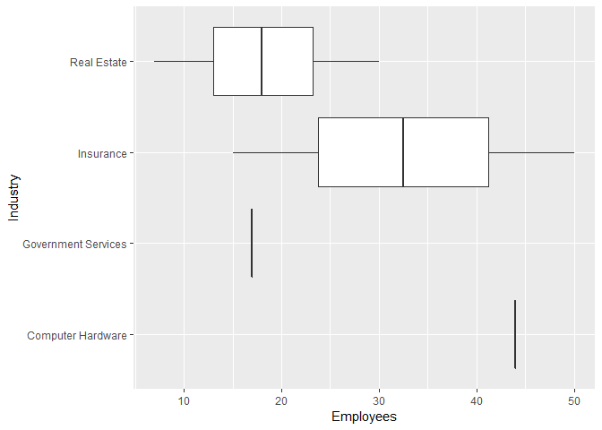
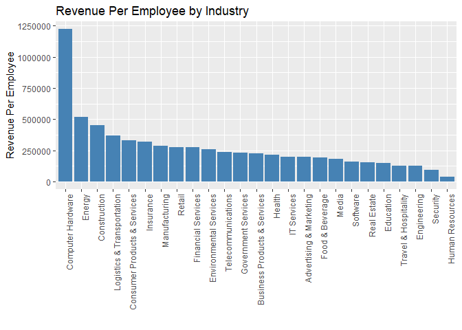
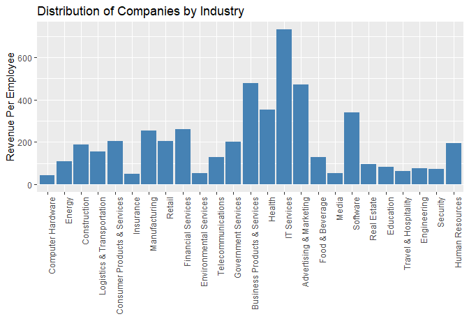

**Principles of Data Visualization and Introduction to ggplot2**

I have provided you with data about the 5,000 fastest growing companies in the US, as compiled by Inc. magazine. lets read this in:


```r
inc <- read.csv("https://raw.githubusercontent.com/charleyferrari/CUNY_DATA_608/master/module1/Data/inc5000_data.csv", header= TRUE)
```

And lets preview this data:


```r
head(inc)
```

```
##   Rank                         Name Growth_Rate   Revenue
## 1    1                         Fuhu      421.48 1.179e+08
## 2    2        FederalConference.com      248.31 4.960e+07
## 3    3                The HCI Group      245.45 2.550e+07
## 4    4                      Bridger      233.08 1.900e+09
## 5    5                       DataXu      213.37 8.700e+07
## 6    6 MileStone Community Builders      179.38 4.570e+07
##                       Industry Employees         City State
## 1 Consumer Products & Services       104   El Segundo    CA
## 2          Government Services        51     Dumfries    VA
## 3                       Health       132 Jacksonville    FL
## 4                       Energy        50      Addison    TX
## 5      Advertising & Marketing       220       Boston    MA
## 6                  Real Estate        63       Austin    TX
```

```r
summary(inc)
```

```
##       Rank                          Name       Growth_Rate     
##  Min.   :   1   (Add)ventures         :   1   Min.   :  0.340  
##  1st Qu.:1252   @Properties           :   1   1st Qu.:  0.770  
##  Median :2502   1-Stop Translation USA:   1   Median :  1.420  
##  Mean   :2502   110 Consulting        :   1   Mean   :  4.612  
##  3rd Qu.:3751   11thStreetCoffee.com  :   1   3rd Qu.:  3.290  
##  Max.   :5000   123 Exteriors         :   1   Max.   :421.480  
##                 (Other)               :4995                    
##     Revenue                                  Industry      Employees      
##  Min.   :2.000e+06   IT Services                 : 733   Min.   :    1.0  
##  1st Qu.:5.100e+06   Business Products & Services: 482   1st Qu.:   25.0  
##  Median :1.090e+07   Advertising & Marketing     : 471   Median :   53.0  
##  Mean   :4.822e+07   Health                      : 355   Mean   :  232.7  
##  3rd Qu.:2.860e+07   Software                    : 342   3rd Qu.:  132.0  
##  Max.   :1.010e+10   Financial Services          : 260   Max.   :66803.0  
##                      (Other)                     :2358   NA's   :12       
##             City          State     
##  New York     : 160   CA     : 701  
##  Chicago      :  90   TX     : 387  
##  Austin       :  88   NY     : 311  
##  Houston      :  76   VA     : 283  
##  San Francisco:  75   FL     : 282  
##  Atlanta      :  74   IL     : 273  
##  (Other)      :4438   (Other):2764
```


```r
str(inc)
```

```
## 'data.frame':	5001 obs. of  8 variables:
##  $ Rank       : int  1 2 3 4 5 6 7 8 9 10 ...
##  $ Name       : Factor w/ 5001 levels "(Add)ventures",..: 1770 1633 4423 690 1198 2839 4733 1468 1869 4968 ...
##  $ Growth_Rate: num  421 248 245 233 213 ...
##  $ Revenue    : num  1.18e+08 4.96e+07 2.55e+07 1.90e+09 8.70e+07 ...
##  $ Industry   : Factor w/ 25 levels "Advertising & Marketing",..: 5 12 13 7 1 20 10 1 5 21 ...
##  $ Employees  : int  104 51 132 50 220 63 27 75 97 15 ...
##  $ City       : Factor w/ 1519 levels "Acton","Addison",..: 391 365 635 2 139 66 912 1179 131 1418 ...
##  $ State      : Factor w/ 52 levels "AK","AL","AR",..: 5 47 10 45 20 45 44 5 46 41 ...
```

Think a bit on what these summaries mean. Use the space below to add some more relevant non-visual exploratory information you think helps you understand this data:


```r
library(ggplot2)
library(dplyr)
library(kableExtra)
```

### Growth Rate 

I noticed that the growth rate goes from 0.340 to 421.480. Below, you will see that there are 19 companies that experienced growth rates of 100 or higher. 


```r
inc %>% dplyr::filter(Growth_Rate >= 100) %>% summarise(n = n())
```

```
##    n
## 1 19
```

Below is the list of these 19 companies with growth rates of 100 or higher. 


```r
kable(inc %>% dplyr::filter(Growth_Rate >= 100)) %>% kable_styling()
```

<table class="table" style="margin-left: auto; margin-right: auto;">
 <thead>
  <tr>
   <th style="text-align:right;"> Rank </th>
   <th style="text-align:left;"> Name </th>
   <th style="text-align:right;"> Growth_Rate </th>
   <th style="text-align:right;"> Revenue </th>
   <th style="text-align:left;"> Industry </th>
   <th style="text-align:right;"> Employees </th>
   <th style="text-align:left;"> City </th>
   <th style="text-align:left;"> State </th>
  </tr>
 </thead>
<tbody>
  <tr>
   <td style="text-align:right;"> 1 </td>
   <td style="text-align:left;"> Fuhu </td>
   <td style="text-align:right;"> 421.48 </td>
   <td style="text-align:right;"> 1.179e+08 </td>
   <td style="text-align:left;"> Consumer Products &amp; Services </td>
   <td style="text-align:right;"> 104 </td>
   <td style="text-align:left;"> El Segundo </td>
   <td style="text-align:left;"> CA </td>
  </tr>
  <tr>
   <td style="text-align:right;"> 2 </td>
   <td style="text-align:left;"> FederalConference.com </td>
   <td style="text-align:right;"> 248.31 </td>
   <td style="text-align:right;"> 4.960e+07 </td>
   <td style="text-align:left;"> Government Services </td>
   <td style="text-align:right;"> 51 </td>
   <td style="text-align:left;"> Dumfries </td>
   <td style="text-align:left;"> VA </td>
  </tr>
  <tr>
   <td style="text-align:right;"> 3 </td>
   <td style="text-align:left;"> The HCI Group </td>
   <td style="text-align:right;"> 245.45 </td>
   <td style="text-align:right;"> 2.550e+07 </td>
   <td style="text-align:left;"> Health </td>
   <td style="text-align:right;"> 132 </td>
   <td style="text-align:left;"> Jacksonville </td>
   <td style="text-align:left;"> FL </td>
  </tr>
  <tr>
   <td style="text-align:right;"> 4 </td>
   <td style="text-align:left;"> Bridger </td>
   <td style="text-align:right;"> 233.08 </td>
   <td style="text-align:right;"> 1.900e+09 </td>
   <td style="text-align:left;"> Energy </td>
   <td style="text-align:right;"> 50 </td>
   <td style="text-align:left;"> Addison </td>
   <td style="text-align:left;"> TX </td>
  </tr>
  <tr>
   <td style="text-align:right;"> 5 </td>
   <td style="text-align:left;"> DataXu </td>
   <td style="text-align:right;"> 213.37 </td>
   <td style="text-align:right;"> 8.700e+07 </td>
   <td style="text-align:left;"> Advertising &amp; Marketing </td>
   <td style="text-align:right;"> 220 </td>
   <td style="text-align:left;"> Boston </td>
   <td style="text-align:left;"> MA </td>
  </tr>
  <tr>
   <td style="text-align:right;"> 6 </td>
   <td style="text-align:left;"> MileStone Community Builders </td>
   <td style="text-align:right;"> 179.38 </td>
   <td style="text-align:right;"> 4.570e+07 </td>
   <td style="text-align:left;"> Real Estate </td>
   <td style="text-align:right;"> 63 </td>
   <td style="text-align:left;"> Austin </td>
   <td style="text-align:left;"> TX </td>
  </tr>
  <tr>
   <td style="text-align:right;"> 7 </td>
   <td style="text-align:left;"> Value Payment Systems </td>
   <td style="text-align:right;"> 174.04 </td>
   <td style="text-align:right;"> 2.550e+07 </td>
   <td style="text-align:left;"> Financial Services </td>
   <td style="text-align:right;"> 27 </td>
   <td style="text-align:left;"> Nashville </td>
   <td style="text-align:left;"> TN </td>
  </tr>
  <tr>
   <td style="text-align:right;"> 8 </td>
   <td style="text-align:left;"> Emerge Digital Group </td>
   <td style="text-align:right;"> 170.64 </td>
   <td style="text-align:right;"> 2.390e+07 </td>
   <td style="text-align:left;"> Advertising &amp; Marketing </td>
   <td style="text-align:right;"> 75 </td>
   <td style="text-align:left;"> San Francisco </td>
   <td style="text-align:left;"> CA </td>
  </tr>
  <tr>
   <td style="text-align:right;"> 9 </td>
   <td style="text-align:left;"> Goal Zero </td>
   <td style="text-align:right;"> 169.81 </td>
   <td style="text-align:right;"> 3.310e+07 </td>
   <td style="text-align:left;"> Consumer Products &amp; Services </td>
   <td style="text-align:right;"> 97 </td>
   <td style="text-align:left;"> Bluffdale </td>
   <td style="text-align:left;"> UT </td>
  </tr>
  <tr>
   <td style="text-align:right;"> 10 </td>
   <td style="text-align:left;"> Yagoozon </td>
   <td style="text-align:right;"> 166.89 </td>
   <td style="text-align:right;"> 1.860e+07 </td>
   <td style="text-align:left;"> Retail </td>
   <td style="text-align:right;"> 15 </td>
   <td style="text-align:left;"> Warwick </td>
   <td style="text-align:left;"> RI </td>
  </tr>
  <tr>
   <td style="text-align:right;"> 11 </td>
   <td style="text-align:left;"> OBXtek </td>
   <td style="text-align:right;"> 164.33 </td>
   <td style="text-align:right;"> 2.960e+07 </td>
   <td style="text-align:left;"> Government Services </td>
   <td style="text-align:right;"> 149 </td>
   <td style="text-align:left;"> Tysons Corner </td>
   <td style="text-align:left;"> VA </td>
  </tr>
  <tr>
   <td style="text-align:right;"> 12 </td>
   <td style="text-align:left;"> AdRoll </td>
   <td style="text-align:right;"> 150.65 </td>
   <td style="text-align:right;"> 3.410e+07 </td>
   <td style="text-align:left;"> Advertising &amp; Marketing </td>
   <td style="text-align:right;"> 165 </td>
   <td style="text-align:left;"> San Francisco </td>
   <td style="text-align:left;"> CA </td>
  </tr>
  <tr>
   <td style="text-align:right;"> 13 </td>
   <td style="text-align:left;"> uBreakiFix </td>
   <td style="text-align:right;"> 141.02 </td>
   <td style="text-align:right;"> 1.700e+07 </td>
   <td style="text-align:left;"> Retail </td>
   <td style="text-align:right;"> 250 </td>
   <td style="text-align:left;"> Orlando </td>
   <td style="text-align:left;"> FL </td>
  </tr>
  <tr>
   <td style="text-align:right;"> 14 </td>
   <td style="text-align:left;"> Sparc </td>
   <td style="text-align:right;"> 128.63 </td>
   <td style="text-align:right;"> 2.110e+07 </td>
   <td style="text-align:left;"> Software </td>
   <td style="text-align:right;"> 160 </td>
   <td style="text-align:left;"> Charleston </td>
   <td style="text-align:left;"> SC </td>
  </tr>
  <tr>
   <td style="text-align:right;"> 15 </td>
   <td style="text-align:left;"> LivingSocial </td>
   <td style="text-align:right;"> 123.33 </td>
   <td style="text-align:right;"> 5.360e+08 </td>
   <td style="text-align:left;"> Consumer Products &amp; Services </td>
   <td style="text-align:right;"> 4100 </td>
   <td style="text-align:left;"> Washington </td>
   <td style="text-align:left;"> DC </td>
  </tr>
  <tr>
   <td style="text-align:right;"> 16 </td>
   <td style="text-align:left;"> Amped Wireless </td>
   <td style="text-align:right;"> 110.68 </td>
   <td style="text-align:right;"> 1.430e+07 </td>
   <td style="text-align:left;"> Computer Hardware </td>
   <td style="text-align:right;"> 26 </td>
   <td style="text-align:left;"> Chino </td>
   <td style="text-align:left;"> CA </td>
  </tr>
  <tr>
   <td style="text-align:right;"> 17 </td>
   <td style="text-align:left;"> Intelligent Audit </td>
   <td style="text-align:right;"> 105.73 </td>
   <td style="text-align:right;"> 1.450e+08 </td>
   <td style="text-align:left;"> Logistics &amp; Transportation </td>
   <td style="text-align:right;"> 15 </td>
   <td style="text-align:left;"> Rochelle Park </td>
   <td style="text-align:left;"> NJ </td>
  </tr>
  <tr>
   <td style="text-align:right;"> 18 </td>
   <td style="text-align:left;"> Integrity Funding </td>
   <td style="text-align:right;"> 104.62 </td>
   <td style="text-align:right;"> 1.110e+07 </td>
   <td style="text-align:left;"> Financial Services </td>
   <td style="text-align:right;"> 11 </td>
   <td style="text-align:left;"> Sarasota </td>
   <td style="text-align:left;"> FL </td>
  </tr>
  <tr>
   <td style="text-align:right;"> 19 </td>
   <td style="text-align:left;"> Vertex Body Sciences </td>
   <td style="text-align:right;"> 100.10 </td>
   <td style="text-align:right;"> 1.180e+07 </td>
   <td style="text-align:left;"> Food &amp; Beverage </td>
   <td style="text-align:right;"> 51 </td>
   <td style="text-align:left;"> columbus </td>
   <td style="text-align:left;"> OH </td>
  </tr>
</tbody>
</table>

### Revenue

The revenue ranges from 2 million to about 10 billion. The median revenue is about 11 million.  


```r
inc %>% dplyr::summarise(min=min(Revenue), median=median(Revenue), max=max(Revenue))
```

```
##     min   median      max
## 1 2e+06 10900000 1.01e+10
```

### Industry

There are 25 distinct industries. 


```r
kable(inc %>% dplyr::group_by(Industry) %>% dplyr::summarise(n=n()) %>% arrange(desc(n))) %>% kable_styling()
```

<table class="table" style="margin-left: auto; margin-right: auto;">
 <thead>
  <tr>
   <th style="text-align:left;"> Industry </th>
   <th style="text-align:right;"> n </th>
  </tr>
 </thead>
<tbody>
  <tr>
   <td style="text-align:left;"> IT Services </td>
   <td style="text-align:right;"> 733 </td>
  </tr>
  <tr>
   <td style="text-align:left;"> Business Products &amp; Services </td>
   <td style="text-align:right;"> 482 </td>
  </tr>
  <tr>
   <td style="text-align:left;"> Advertising &amp; Marketing </td>
   <td style="text-align:right;"> 471 </td>
  </tr>
  <tr>
   <td style="text-align:left;"> Health </td>
   <td style="text-align:right;"> 355 </td>
  </tr>
  <tr>
   <td style="text-align:left;"> Software </td>
   <td style="text-align:right;"> 342 </td>
  </tr>
  <tr>
   <td style="text-align:left;"> Financial Services </td>
   <td style="text-align:right;"> 260 </td>
  </tr>
  <tr>
   <td style="text-align:left;"> Manufacturing </td>
   <td style="text-align:right;"> 256 </td>
  </tr>
  <tr>
   <td style="text-align:left;"> Consumer Products &amp; Services </td>
   <td style="text-align:right;"> 203 </td>
  </tr>
  <tr>
   <td style="text-align:left;"> Retail </td>
   <td style="text-align:right;"> 203 </td>
  </tr>
  <tr>
   <td style="text-align:left;"> Government Services </td>
   <td style="text-align:right;"> 202 </td>
  </tr>
  <tr>
   <td style="text-align:left;"> Human Resources </td>
   <td style="text-align:right;"> 196 </td>
  </tr>
  <tr>
   <td style="text-align:left;"> Construction </td>
   <td style="text-align:right;"> 187 </td>
  </tr>
  <tr>
   <td style="text-align:left;"> Logistics &amp; Transportation </td>
   <td style="text-align:right;"> 155 </td>
  </tr>
  <tr>
   <td style="text-align:left;"> Food &amp; Beverage </td>
   <td style="text-align:right;"> 131 </td>
  </tr>
  <tr>
   <td style="text-align:left;"> Telecommunications </td>
   <td style="text-align:right;"> 129 </td>
  </tr>
  <tr>
   <td style="text-align:left;"> Energy </td>
   <td style="text-align:right;"> 109 </td>
  </tr>
  <tr>
   <td style="text-align:left;"> Real Estate </td>
   <td style="text-align:right;"> 96 </td>
  </tr>
  <tr>
   <td style="text-align:left;"> Education </td>
   <td style="text-align:right;"> 83 </td>
  </tr>
  <tr>
   <td style="text-align:left;"> Engineering </td>
   <td style="text-align:right;"> 74 </td>
  </tr>
  <tr>
   <td style="text-align:left;"> Security </td>
   <td style="text-align:right;"> 73 </td>
  </tr>
  <tr>
   <td style="text-align:left;"> Travel &amp; Hospitality </td>
   <td style="text-align:right;"> 62 </td>
  </tr>
  <tr>
   <td style="text-align:left;"> Media </td>
   <td style="text-align:right;"> 54 </td>
  </tr>
  <tr>
   <td style="text-align:left;"> Environmental Services </td>
   <td style="text-align:right;"> 51 </td>
  </tr>
  <tr>
   <td style="text-align:left;"> Insurance </td>
   <td style="text-align:right;"> 50 </td>
  </tr>
  <tr>
   <td style="text-align:left;"> Computer Hardware </td>
   <td style="text-align:right;"> 44 </td>
  </tr>
</tbody>
</table>

### Employees

There are some companies that do not have data for Employee. The number of employees range from 1 to 66,803. The median employee size is 53. 


```r
kable(inc %>% dplyr::summarise(min=min(Employees, na.rm = TRUE), median=median(Employees, na.rm = TRUE), max=max(Employees, na.rm = TRUE))) %>% kable_styling()
```

<table class="table" style="margin-left: auto; margin-right: auto;">
 <thead>
  <tr>
   <th style="text-align:right;"> min </th>
   <th style="text-align:right;"> median </th>
   <th style="text-align:right;"> max </th>
  </tr>
 </thead>
<tbody>
  <tr>
   <td style="text-align:right;"> 1 </td>
   <td style="text-align:right;"> 53 </td>
   <td style="text-align:right;"> 66803 </td>
  </tr>
</tbody>
</table>

### City

There are 1,519 distinct cities. 


```r
cities <- inc %>% group_by(City) %>% summarise(n=n())
nrow(cities)
```

```
## [1] 1519
```

These are the top 10 cities (based on the number of companies that are located in the city). 


```r
kable(inc %>% group_by(City) %>% summarise(n=n()) %>% arrange(desc(n)) %>% top_n(10)) %>% kable_styling()
```

```
## Selecting by n
```

<table class="table" style="margin-left: auto; margin-right: auto;">
 <thead>
  <tr>
   <th style="text-align:left;"> City </th>
   <th style="text-align:right;"> n </th>
  </tr>
 </thead>
<tbody>
  <tr>
   <td style="text-align:left;"> New York </td>
   <td style="text-align:right;"> 160 </td>
  </tr>
  <tr>
   <td style="text-align:left;"> Chicago </td>
   <td style="text-align:right;"> 90 </td>
  </tr>
  <tr>
   <td style="text-align:left;"> Austin </td>
   <td style="text-align:right;"> 88 </td>
  </tr>
  <tr>
   <td style="text-align:left;"> Houston </td>
   <td style="text-align:right;"> 76 </td>
  </tr>
  <tr>
   <td style="text-align:left;"> San Francisco </td>
   <td style="text-align:right;"> 75 </td>
  </tr>
  <tr>
   <td style="text-align:left;"> Atlanta </td>
   <td style="text-align:right;"> 74 </td>
  </tr>
  <tr>
   <td style="text-align:left;"> San Diego </td>
   <td style="text-align:right;"> 67 </td>
  </tr>
  <tr>
   <td style="text-align:left;"> Seattle </td>
   <td style="text-align:right;"> 52 </td>
  </tr>
  <tr>
   <td style="text-align:left;"> Boston </td>
   <td style="text-align:right;"> 43 </td>
  </tr>
  <tr>
   <td style="text-align:left;"> Dallas </td>
   <td style="text-align:right;"> 42 </td>
  </tr>
  <tr>
   <td style="text-align:left;"> Denver </td>
   <td style="text-align:right;"> 42 </td>
  </tr>
</tbody>
</table>

### State

There are 52 distinct states in the data set. 


```r
states <- inc %>% group_by(State) %>% summarise(n=n())
nrow(states)
```

```
## [1] 52
```

These are the top 10 States (based on the number of companies that are located in the State). 


```r
kable(inc %>% group_by(State) %>% summarise(n=n()) %>% arrange(desc(n)) %>% top_n(10)) %>% kable_styling()
```

```
## Selecting by n
```

<table class="table" style="margin-left: auto; margin-right: auto;">
 <thead>
  <tr>
   <th style="text-align:left;"> State </th>
   <th style="text-align:right;"> n </th>
  </tr>
 </thead>
<tbody>
  <tr>
   <td style="text-align:left;"> CA </td>
   <td style="text-align:right;"> 701 </td>
  </tr>
  <tr>
   <td style="text-align:left;"> TX </td>
   <td style="text-align:right;"> 387 </td>
  </tr>
  <tr>
   <td style="text-align:left;"> NY </td>
   <td style="text-align:right;"> 311 </td>
  </tr>
  <tr>
   <td style="text-align:left;"> VA </td>
   <td style="text-align:right;"> 283 </td>
  </tr>
  <tr>
   <td style="text-align:left;"> FL </td>
   <td style="text-align:right;"> 282 </td>
  </tr>
  <tr>
   <td style="text-align:left;"> IL </td>
   <td style="text-align:right;"> 273 </td>
  </tr>
  <tr>
   <td style="text-align:left;"> GA </td>
   <td style="text-align:right;"> 212 </td>
  </tr>
  <tr>
   <td style="text-align:left;"> OH </td>
   <td style="text-align:right;"> 186 </td>
  </tr>
  <tr>
   <td style="text-align:left;"> MA </td>
   <td style="text-align:right;"> 182 </td>
  </tr>
  <tr>
   <td style="text-align:left;"> PA </td>
   <td style="text-align:right;"> 164 </td>
  </tr>
</tbody>
</table>

---

## Question 1

Create a graph that shows the distribution of companies in the data set by State (ie how many are in each state). There are a lot of States, so consider which axis you should use. This visualization is ultimately going to be consumed on a 'portrait' oriented screen (ie taller than wide), which should further guide your layout choices.


```r
# Answer Question 1 here

ordered <- inc %>% group_by(State) %>% summarise(n=n()) %>% arrange(desc(n))

plt1 <- 
  ggplot(data = ordered[1:52,], aes(x=reorder(State,n), y=n)) + 
  geom_bar(stat="identity", width=0.5, color="#1F3552", fill="steelblue", 
           position=position_dodge()) +
    #geom_text(aes(label=round(n, digits=2)), hjust=1.3, size=3.0, color="white") + 
    coord_flip() + 
    scale_y_continuous(breaks=seq(0,700,100)) + 
    ggtitle("Disbribution by State") +
    xlab("") + ylab("") + 
    theme_minimal()
```

I couldn't find a way to increase the plot canvas size. This would look better if there's more space in between each state, and the bars are slightly bigger. 

The graph below orders the distribution from highest to lowest states. 


```r
plt1
```

<!-- -->


---


## Quesiton 2

Lets dig in on the state with the 3rd most companies in the data set. Imagine you work for the state and are interested in how many people are employed by companies in different industries. Create a plot that shows the average and/or median employment by industry for companies in this state (only use cases with full data, use R's `complete.cases()` function.) In addition to this, your graph should show how variable the ranges are, and you should deal with outliers.

As you can see, the state with the 3rd most companies in the data set is New York. 


```r
kable(inc %>% group_by(State) %>% summarise(n=n()) %>% arrange(desc(n)) %>% top_n(3)) %>% kable_styling()
```

```
## Selecting by n
```

<table class="table" style="margin-left: auto; margin-right: auto;">
 <thead>
  <tr>
   <th style="text-align:left;"> State </th>
   <th style="text-align:right;"> n </th>
  </tr>
 </thead>
<tbody>
  <tr>
   <td style="text-align:left;"> CA </td>
   <td style="text-align:right;"> 701 </td>
  </tr>
  <tr>
   <td style="text-align:left;"> TX </td>
   <td style="text-align:right;"> 387 </td>
  </tr>
  <tr>
   <td style="text-align:left;"> NY </td>
   <td style="text-align:right;"> 311 </td>
  </tr>
</tbody>
</table>


`inc_cc` holds complete cases only. 


```r
inc_cc <- inc[complete.cases(inc),]
```

Below is a break down of median number of employees in each industry for New York state. It shows the min, median, and max number of employees for each industry in NY. It is ordered from highest to lowest variability. 


```r
kable(inc_cc %>% filter(State=='NY') %>% group_by(Industry) %>% summarise(min=min(Employees),median=median(Employees), max=max(Employees), var=var(Employees)) %>% arrange(desc(var))) %>% kable_styling()
```

<table class="table" style="margin-left: auto; margin-right: auto;">
 <thead>
  <tr>
   <th style="text-align:left;"> Industry </th>
   <th style="text-align:right;"> min </th>
   <th style="text-align:right;"> median </th>
   <th style="text-align:right;"> max </th>
   <th style="text-align:right;"> var </th>
  </tr>
 </thead>
<tbody>
  <tr>
   <td style="text-align:left;"> Business Products &amp; Services </td>
   <td style="text-align:right;"> 4 </td>
   <td style="text-align:right;"> 70.5 </td>
   <td style="text-align:right;"> 32000 </td>
   <td style="text-align:right;"> 3.894641e+07 </td>
  </tr>
  <tr>
   <td style="text-align:left;"> Consumer Products &amp; Services </td>
   <td style="text-align:right;"> 5 </td>
   <td style="text-align:right;"> 25.0 </td>
   <td style="text-align:right;"> 10000 </td>
   <td style="text-align:right;"> 5.835802e+06 </td>
  </tr>
  <tr>
   <td style="text-align:left;"> Travel &amp; Hospitality </td>
   <td style="text-align:right;"> 6 </td>
   <td style="text-align:right;"> 61.0 </td>
   <td style="text-align:right;"> 2280 </td>
   <td style="text-align:right;"> 6.974669e+05 </td>
  </tr>
  <tr>
   <td style="text-align:left;"> Human Resources </td>
   <td style="text-align:right;"> 7 </td>
   <td style="text-align:right;"> 56.0 </td>
   <td style="text-align:right;"> 2081 </td>
   <td style="text-align:right;"> 4.634787e+05 </td>
  </tr>
  <tr>
   <td style="text-align:left;"> IT Services </td>
   <td style="text-align:right;"> 8 </td>
   <td style="text-align:right;"> 54.0 </td>
   <td style="text-align:right;"> 3000 </td>
   <td style="text-align:right;"> 2.241769e+05 </td>
  </tr>
  <tr>
   <td style="text-align:left;"> Software </td>
   <td style="text-align:right;"> 15 </td>
   <td style="text-align:right;"> 80.0 </td>
   <td style="text-align:right;"> 1271 </td>
   <td style="text-align:right;"> 1.404907e+05 </td>
  </tr>
  <tr>
   <td style="text-align:left;"> Security </td>
   <td style="text-align:right;"> 25 </td>
   <td style="text-align:right;"> 32.5 </td>
   <td style="text-align:right;"> 450 </td>
   <td style="text-align:right;"> 4.415000e+04 </td>
  </tr>
  <tr>
   <td style="text-align:left;"> Media </td>
   <td style="text-align:right;"> 4 </td>
   <td style="text-align:right;"> 45.0 </td>
   <td style="text-align:right;"> 602 </td>
   <td style="text-align:right;"> 3.099560e+04 </td>
  </tr>
  <tr>
   <td style="text-align:left;"> Financial Services </td>
   <td style="text-align:right;"> 14 </td>
   <td style="text-align:right;"> 81.0 </td>
   <td style="text-align:right;"> 483 </td>
   <td style="text-align:right;"> 2.299190e+04 </td>
  </tr>
  <tr>
   <td style="text-align:left;"> Environmental Services </td>
   <td style="text-align:right;"> 60 </td>
   <td style="text-align:right;"> 155.0 </td>
   <td style="text-align:right;"> 250 </td>
   <td style="text-align:right;"> 1.805000e+04 </td>
  </tr>
  <tr>
   <td style="text-align:left;"> Food &amp; Beverage </td>
   <td style="text-align:right;"> 5 </td>
   <td style="text-align:right;"> 41.0 </td>
   <td style="text-align:right;"> 383 </td>
   <td style="text-align:right;"> 1.390028e+04 </td>
  </tr>
  <tr>
   <td style="text-align:left;"> Energy </td>
   <td style="text-align:right;"> 5 </td>
   <td style="text-align:right;"> 120.0 </td>
   <td style="text-align:right;"> 294 </td>
   <td style="text-align:right;"> 1.106670e+04 </td>
  </tr>
  <tr>
   <td style="text-align:left;"> Telecommunications </td>
   <td style="text-align:right;"> 6 </td>
   <td style="text-align:right;"> 31.0 </td>
   <td style="text-align:right;"> 316 </td>
   <td style="text-align:right;"> 1.064462e+04 </td>
  </tr>
  <tr>
   <td style="text-align:left;"> Manufacturing </td>
   <td style="text-align:right;"> 11 </td>
   <td style="text-align:right;"> 30.0 </td>
   <td style="text-align:right;"> 307 </td>
   <td style="text-align:right;"> 8.048231e+03 </td>
  </tr>
  <tr>
   <td style="text-align:left;"> Health </td>
   <td style="text-align:right;"> 2 </td>
   <td style="text-align:right;"> 45.0 </td>
   <td style="text-align:right;"> 298 </td>
   <td style="text-align:right;"> 7.505141e+03 </td>
  </tr>
  <tr>
   <td style="text-align:left;"> Construction </td>
   <td style="text-align:right;"> 10 </td>
   <td style="text-align:right;"> 24.5 </td>
   <td style="text-align:right;"> 219 </td>
   <td style="text-align:right;"> 6.392000e+03 </td>
  </tr>
  <tr>
   <td style="text-align:left;"> Advertising &amp; Marketing </td>
   <td style="text-align:right;"> 2 </td>
   <td style="text-align:right;"> 38.0 </td>
   <td style="text-align:right;"> 270 </td>
   <td style="text-align:right;"> 3.872536e+03 </td>
  </tr>
  <tr>
   <td style="text-align:left;"> Education </td>
   <td style="text-align:right;"> 19 </td>
   <td style="text-align:right;"> 50.5 </td>
   <td style="text-align:right;"> 200 </td>
   <td style="text-align:right;"> 2.359516e+03 </td>
  </tr>
  <tr>
   <td style="text-align:left;"> Engineering </td>
   <td style="text-align:right;"> 11 </td>
   <td style="text-align:right;"> 54.5 </td>
   <td style="text-align:right;"> 94 </td>
   <td style="text-align:right;"> 1.583000e+03 </td>
  </tr>
  <tr>
   <td style="text-align:left;"> Logistics &amp; Transportation </td>
   <td style="text-align:right;"> 1 </td>
   <td style="text-align:right;"> 23.5 </td>
   <td style="text-align:right;"> 70 </td>
   <td style="text-align:right;"> 8.430000e+02 </td>
  </tr>
  <tr>
   <td style="text-align:left;"> Retail </td>
   <td style="text-align:right;"> 3 </td>
   <td style="text-align:right;"> 13.5 </td>
   <td style="text-align:right;"> 75 </td>
   <td style="text-align:right;"> 6.378736e+02 </td>
  </tr>
  <tr>
   <td style="text-align:left;"> Insurance </td>
   <td style="text-align:right;"> 15 </td>
   <td style="text-align:right;"> 32.5 </td>
   <td style="text-align:right;"> 50 </td>
   <td style="text-align:right;"> 6.125000e+02 </td>
  </tr>
  <tr>
   <td style="text-align:left;"> Real Estate </td>
   <td style="text-align:right;"> 7 </td>
   <td style="text-align:right;"> 18.0 </td>
   <td style="text-align:right;"> 30 </td>
   <td style="text-align:right;"> 9.425000e+01 </td>
  </tr>
  <tr>
   <td style="text-align:left;"> Computer Hardware </td>
   <td style="text-align:right;"> 44 </td>
   <td style="text-align:right;"> 44.0 </td>
   <td style="text-align:right;"> 44 </td>
   <td style="text-align:right;"> NA </td>
  </tr>
  <tr>
   <td style="text-align:left;"> Government Services </td>
   <td style="text-align:right;"> 17 </td>
   <td style="text-align:right;"> 17.0 </td>
   <td style="text-align:right;"> 17 </td>
   <td style="text-align:right;"> NA </td>
  </tr>
</tbody>
</table>

A box plot could show the median number employees (this is indicated by the dark black line in the box). A box plot also shows the range of the data and outliers (indicated by a red asterisk symbol). 

There are 25 different industries. I tried plotting them all in a single box plot call, and the result was too tiny to get any kind of useful information. In question 1, I also had a similar problem of properly spacing out the data elements on the screen. As a workaround, I created vectors that group records based on variability. The table above was used for this purpose. In this case, companies that have higher variability in number of employees are also ones with higher maximum number of employees. 

The code below groups industries together with similar variability. I try to limit each group up to 5 industries so that the plot doesn't get too small. 


```r
g1a <- c('Business Products & Services')
g1b <- c('Consumer Products & Services')
g2 <- c('Travel & Hospitality', 'Human Resources', 'IT Services', 'Software')
g3 <- c('Security', 'Media', 'Financial Services',  'Environmental Services', 'Food & Beverage')
g4 <- c('Energy', 'Telecommunications', 'Manufacturing', 'Health', 'Construction')
g5 <- c('Advertising & Marketing', 'Education', 'Engineering', 'Logistics & Transportation', 'Retail')
g6 <- c('Insurance', 'Real Estate', 'Computer Hardware', 'Government Services')
```


Below is the code for creating the box plots for each grouping. 

Please note that each plot for each group has a different x-axis scale, which depends on the range of number of employees for each respective group. 

The industries 'Computer Hardware' and 'Government Services' do not have enough data to generate a box plot. 


```r
plt_g1a <- ggplot(inc_cc %>% filter(State=='NY' & Industry %in% g1a), aes(x = Industry, y = Employees)) + 
        coord_flip() + 
        geom_boxplot(outlier.colour="red", outlier.shape=8,
             outlier.size=1, notch=FALSE)

plt_g1b <- ggplot(inc_cc %>% filter(State=='NY' & Industry %in% g1b), aes(x = Industry, y = Employees)) + 
        coord_flip() + 
        geom_boxplot(outlier.colour="red", outlier.shape=8,
             outlier.size=1, notch=FALSE)

plt_g2 <- ggplot(inc_cc %>% filter(State=='NY' & Industry %in% g2), aes(x = Industry, y = Employees)) + 
        coord_flip() + 
        geom_boxplot(outlier.colour="red", outlier.shape=8,
             outlier.size=1, notch=FALSE)

plt_g3 <- ggplot(inc_cc %>% filter(State=='NY' & Industry %in% g3), aes(x = Industry, y = Employees)) + 
        coord_flip() + 
        geom_boxplot(outlier.colour="red", outlier.shape=8,
             outlier.size=1, notch=FALSE)

plt_g4 <- ggplot(inc_cc %>% filter(State=='NY' & Industry %in% g4), aes(x = Industry, y = Employees)) + 
        coord_flip() + 
        geom_boxplot(outlier.colour="red", outlier.shape=8,
             outlier.size=1, notch=FALSE)

plt_g5 <- ggplot(inc_cc %>% filter(State=='NY' & Industry %in% g5), aes(x = Industry, y = Employees)) + 
        coord_flip() + 
        geom_boxplot(outlier.colour="red", outlier.shape=8,
             outlier.size=1, notch=FALSE) 

plt_g6 <- ggplot(inc_cc %>% filter(State=='NY' & Industry %in% g6), aes(x = Industry, y = Employees)) + 
        coord_flip() + 
        geom_boxplot(outlier.colour="red", outlier.shape=8,
             outlier.size=1, notch=FALSE)
```


I created a separate group for 'Business Products & Services' and 'Consumer Products & Services' because the box plots for these came out so tiny. It looks like the outlier data is causing the box plot of these 2 industries to flatten out too much. 


```r
plt_g1a
```

<!-- -->

```r
plt_g1b
```

<!-- -->

Below are the box plots for the rest of the other industries. 

Please be mindful that the x-axis scale for each grouping is different. 

<!-- --><!-- --><!-- --><!-- --><!-- -->

---

## Question 3

Now imagine you work for an investor and want to see which industries generate the most revenue per employee. Create a chart that makes this information clear. Once again, the distribution per industry should be shown.

The table below shows the total number of companies in each industry and the revenue per employee for each industry. 


```r
revenue_per_employee <- 
inc_cc %>% group_by(Industry) %>% summarise(count=n(), total_revenue=sum(Revenue), total_employees=sum(Employees), revenue_per_employee=total_revenue/total_employees) %>% arrange(desc(revenue_per_employee))

kable(revenue_per_employee) %>% kable_styling()
```

<table class="table" style="margin-left: auto; margin-right: auto;">
 <thead>
  <tr>
   <th style="text-align:left;"> Industry </th>
   <th style="text-align:right;"> count </th>
   <th style="text-align:right;"> total_revenue </th>
   <th style="text-align:right;"> total_employees </th>
   <th style="text-align:right;"> revenue_per_employee </th>
  </tr>
 </thead>
<tbody>
  <tr>
   <td style="text-align:left;"> Computer Hardware </td>
   <td style="text-align:right;"> 44 </td>
   <td style="text-align:right;"> 11885700000 </td>
   <td style="text-align:right;"> 9714 </td>
   <td style="text-align:right;"> 1223563.93 </td>
  </tr>
  <tr>
   <td style="text-align:left;"> Energy </td>
   <td style="text-align:right;"> 109 </td>
   <td style="text-align:right;"> 13771600000 </td>
   <td style="text-align:right;"> 26437 </td>
   <td style="text-align:right;"> 520921.44 </td>
  </tr>
  <tr>
   <td style="text-align:left;"> Construction </td>
   <td style="text-align:right;"> 187 </td>
   <td style="text-align:right;"> 13174300000 </td>
   <td style="text-align:right;"> 29099 </td>
   <td style="text-align:right;"> 452740.64 </td>
  </tr>
  <tr>
   <td style="text-align:left;"> Logistics &amp; Transportation </td>
   <td style="text-align:right;"> 154 </td>
   <td style="text-align:right;"> 14837800000 </td>
   <td style="text-align:right;"> 39994 </td>
   <td style="text-align:right;"> 371000.65 </td>
  </tr>
  <tr>
   <td style="text-align:left;"> Consumer Products &amp; Services </td>
   <td style="text-align:right;"> 203 </td>
   <td style="text-align:right;"> 14956400000 </td>
   <td style="text-align:right;"> 45464 </td>
   <td style="text-align:right;"> 328972.37 </td>
  </tr>
  <tr>
   <td style="text-align:left;"> Insurance </td>
   <td style="text-align:right;"> 50 </td>
   <td style="text-align:right;"> 2337900000 </td>
   <td style="text-align:right;"> 7339 </td>
   <td style="text-align:right;"> 318558.39 </td>
  </tr>
  <tr>
   <td style="text-align:left;"> Manufacturing </td>
   <td style="text-align:right;"> 255 </td>
   <td style="text-align:right;"> 12603600000 </td>
   <td style="text-align:right;"> 43942 </td>
   <td style="text-align:right;"> 286823.54 </td>
  </tr>
  <tr>
   <td style="text-align:left;"> Retail </td>
   <td style="text-align:right;"> 203 </td>
   <td style="text-align:right;"> 10257400000 </td>
   <td style="text-align:right;"> 37068 </td>
   <td style="text-align:right;"> 276718.46 </td>
  </tr>
  <tr>
   <td style="text-align:left;"> Financial Services </td>
   <td style="text-align:right;"> 260 </td>
   <td style="text-align:right;"> 13150900000 </td>
   <td style="text-align:right;"> 47693 </td>
   <td style="text-align:right;"> 275740.67 </td>
  </tr>
  <tr>
   <td style="text-align:left;"> Environmental Services </td>
   <td style="text-align:right;"> 51 </td>
   <td style="text-align:right;"> 2638800000 </td>
   <td style="text-align:right;"> 10155 </td>
   <td style="text-align:right;"> 259852.29 </td>
  </tr>
  <tr>
   <td style="text-align:left;"> Telecommunications </td>
   <td style="text-align:right;"> 127 </td>
   <td style="text-align:right;"> 7287900000 </td>
   <td style="text-align:right;"> 30842 </td>
   <td style="text-align:right;"> 236297.91 </td>
  </tr>
  <tr>
   <td style="text-align:left;"> Government Services </td>
   <td style="text-align:right;"> 202 </td>
   <td style="text-align:right;"> 6009100000 </td>
   <td style="text-align:right;"> 26185 </td>
   <td style="text-align:right;"> 229486.35 </td>
  </tr>
  <tr>
   <td style="text-align:left;"> Business Products &amp; Services </td>
   <td style="text-align:right;"> 480 </td>
   <td style="text-align:right;"> 26345900000 </td>
   <td style="text-align:right;"> 117357 </td>
   <td style="text-align:right;"> 224493.64 </td>
  </tr>
  <tr>
   <td style="text-align:left;"> Health </td>
   <td style="text-align:right;"> 354 </td>
   <td style="text-align:right;"> 17860100000 </td>
   <td style="text-align:right;"> 82430 </td>
   <td style="text-align:right;"> 216669.90 </td>
  </tr>
  <tr>
   <td style="text-align:left;"> IT Services </td>
   <td style="text-align:right;"> 732 </td>
   <td style="text-align:right;"> 20525000000 </td>
   <td style="text-align:right;"> 102788 </td>
   <td style="text-align:right;"> 199682.84 </td>
  </tr>
  <tr>
   <td style="text-align:left;"> Advertising &amp; Marketing </td>
   <td style="text-align:right;"> 471 </td>
   <td style="text-align:right;"> 7785000000 </td>
   <td style="text-align:right;"> 39731 </td>
   <td style="text-align:right;"> 195942.71 </td>
  </tr>
  <tr>
   <td style="text-align:left;"> Food &amp; Beverage </td>
   <td style="text-align:right;"> 129 </td>
   <td style="text-align:right;"> 12812500000 </td>
   <td style="text-align:right;"> 65911 </td>
   <td style="text-align:right;"> 194390.92 </td>
  </tr>
  <tr>
   <td style="text-align:left;"> Media </td>
   <td style="text-align:right;"> 54 </td>
   <td style="text-align:right;"> 1742400000 </td>
   <td style="text-align:right;"> 9532 </td>
   <td style="text-align:right;"> 182794.80 </td>
  </tr>
  <tr>
   <td style="text-align:left;"> Software </td>
   <td style="text-align:right;"> 341 </td>
   <td style="text-align:right;"> 8134600000 </td>
   <td style="text-align:right;"> 51262 </td>
   <td style="text-align:right;"> 158686.75 </td>
  </tr>
  <tr>
   <td style="text-align:left;"> Real Estate </td>
   <td style="text-align:right;"> 95 </td>
   <td style="text-align:right;"> 2956800000 </td>
   <td style="text-align:right;"> 18893 </td>
   <td style="text-align:right;"> 156502.41 </td>
  </tr>
  <tr>
   <td style="text-align:left;"> Education </td>
   <td style="text-align:right;"> 83 </td>
   <td style="text-align:right;"> 1139300000 </td>
   <td style="text-align:right;"> 7685 </td>
   <td style="text-align:right;"> 148249.84 </td>
  </tr>
  <tr>
   <td style="text-align:left;"> Travel &amp; Hospitality </td>
   <td style="text-align:right;"> 62 </td>
   <td style="text-align:right;"> 2931600000 </td>
   <td style="text-align:right;"> 23035 </td>
   <td style="text-align:right;"> 127267.20 </td>
  </tr>
  <tr>
   <td style="text-align:left;"> Engineering </td>
   <td style="text-align:right;"> 74 </td>
   <td style="text-align:right;"> 2532500000 </td>
   <td style="text-align:right;"> 20435 </td>
   <td style="text-align:right;"> 123929.53 </td>
  </tr>
  <tr>
   <td style="text-align:left;"> Security </td>
   <td style="text-align:right;"> 73 </td>
   <td style="text-align:right;"> 3812800000 </td>
   <td style="text-align:right;"> 41059 </td>
   <td style="text-align:right;"> 92861.49 </td>
  </tr>
  <tr>
   <td style="text-align:left;"> Human Resources </td>
   <td style="text-align:right;"> 196 </td>
   <td style="text-align:right;"> 9246100000 </td>
   <td style="text-align:right;"> 226980 </td>
   <td style="text-align:right;"> 40735.31 </td>
  </tr>
</tbody>
</table>


The code below plots the revenue per employee as a bar chart sorted by revenue per employee from highest to lowest. A second bar chart plot is generated that shows the distribution of companies by industry sorted by revenue per employee from highest to lowest (same order as the first plot). 


```r
plt3_1 <- ggplot(data=revenue_per_employee, aes(x=reorder(Industry,-revenue_per_employee), y=revenue_per_employee)) +
     geom_bar(stat="identity", fill="steelblue") +
     theme(axis.text.x = element_text(angle = 90, hjust = 1)) + 
     ggtitle("Revenue Per Employee by Industry") + 
     ylab("Revenue Per Employee") + 
     xlab("")

plt3_2 <- ggplot(data=revenue_per_employee, aes(x=reorder(Industry,-revenue_per_employee), y=count)) +
     geom_bar(stat="identity", fill="steelblue") +
     theme(axis.text.x = element_text(angle = 90, hjust = 1)) + 
     ggtitle("Distribution of Companies by Industry") + 
     ylab("Revenue Per Employee") + 
     xlab("")
```


<!-- --><!-- -->

